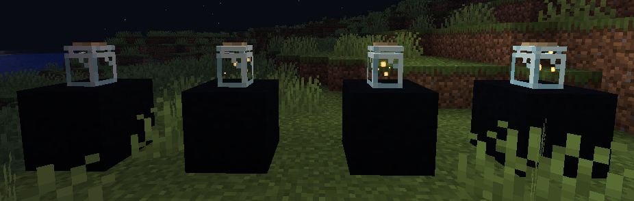

## Обзор

[**Beautify!**](https://modrinth.com/mod/beautify) - это модификация на Forge, от [Pandarix.](https://modrinth.com/user/Pandarix) На сервере используется неофициальный порт под названием [**Beautify: Refabricated**](https://modrinth.com/mod/beautify-refabricated) от [Suel_ki.](https://modrinth.com/user/Suel_ki)

Модификация добавляет новые виды декораций, которые идеально подходят под ванильный стиль игры. Их простой крафт и сочетание с ванилью в два счёта делают дома игроков более уютными и красивыми. Рецепты крафтов всех предметов, можно узнать из книги рецептов или из этой статьи.

### Решетчатые экраны

Крафтятся из одного любого ванильного бревна по середине, и четырёх палок по краям.

 

  
 

 
Имеют свойство лестницы, благодаря чему по ним можно забираться наверх. На них можно посадить определённые виды растений, а именно: розовый куст, подсолнух, пион, сирень, лианы, плакучую лозу, вьющуюся лозу и светящийся лишайник. Ставятся только вертикально. Имеет 10 вариаций в зависимости от бревна в крафте. При ломании стены сзади их, не выпадают, а остаются висеть в воздухе.

    
    

### Жалюзи

Крафтятся из четырёх палочек и двух деревянных полублоков (исключение: железные жалюзи делаются из четырёх палок и двух слитков железа).

   
   

Если поставить несколько жалюзей одного типа рядом, то они соединятся и у игрока получится одна большая занавеска, которая может быть в высоту семь блоков, и в ширину семь блоков, но только если открывать жалюзи с центра, ибо одни жалюзи открывают только соседние три жалюзи с каждой из сторон. Чтобы открыть или закрыть жалюзи, достаточно нажать правой кнопкой по самой верхней жалюзи.

   

Ставятся только вертикально и при ломании стены сзади их, не выпадают, а продолжают висеть в воздухе. 
Имеют 11 различных видов, 10 деревянных и одни железные.

   

### Рамка для картин

Крафтятся из двух одинаковых деревянных полублоков (искл. для кварцевой нужно два кварцевых полублока), одной шерсти и одной палки.

   

Имеет 13 различных изображений и 11 видов, в зависимости от использованных полублоков. Изображения можно менять нажимая правой кнопкой мыши в присядь. Ставится только на поверхность, повесить на стену нельзя.

   

### Канат

Крафтится из трёх ниток в один вертикальный ряд.

   

Ставится также, как и цепь в обычной игре, но при этом имеет свойства лестницы, благодаря чему можно использовать его, чтобы взбираться вверх. При ломании блока поддержки, остаётся висеть в воздухе.

   

### Висячий горшок

Крафтится из обычного горшка и каната.

   

Ставится на пол и на потолок, поставить на стену не получится. Можно посадить любое растение и оно получит уникальную текстуру, а если использовать костную муку, то растение вырастет и станет свисать с горшка, что можно убрать с помощью ножниц, при этом ножницы не теряют своей прочности. Растение можно убрать нажав правой кнопкой по горшку. При ломании поддерживающего блока, выпадает, а если в горшке был цветок, то цветок выпадает отдельно.

   
   

### Стопка книг

Крафтится из трёх обычных книг.

   

Ставится на только поверхность, повесить на потолок или закрепить на стене нельзя. При ломании поверхности блок выпадает. Можно поменять модель книг, нажав правой кнопкой в присядь. Всего у блока семь уникальных моделей. Также стопки книг могут заменить книжные полки, так как каждая стопка даёт один уровень зачарования.

   
   

### Лампочка

Крафтится из четырёх стеклянных панелей и одной меди.

   

Только ставится и вешается на потолок, закрепить на стене не получится. Лампочку можно включить и выключить, нажав правой кнопкой мыши. При ломании блока поддержки, также ломается.

   

### Бамбуковая лампа

Крафтится из двух бамбуковых палок, двух нитей и одной медного слитка.

   

Ставится также как лампочка и фонарь, или поставить на блок или повесить. Лампу можно включать и выключать, нажав правой кнопкой мыши. При ломании поддерживающего блока выпадает.

   

### Лампа с светокамнем

Крафтится из бутылочки и одной светокаменной пыли.

   

Ставится как фонарь, лампочка, бамбуковая лампа, только поставить или повесить. Работает от светокаменной пыли, если её нет, то лампа не работает. С каждой щепоткой светокаменной пыли, лампа начинает светится сильнее. Максимум может быть 3 щепотки в одной лампе. Чтобы её убрать, нужно пустой рукой нажать правой кнопкой мыши по лампе. Ломается при потере поддержки со стороны блоков.

   
   

### Канделябры

Крафтятся из трёх свечей одного цвета и четырёх кусочков железа.

   

Имеет семнадцать вариаций, в зависимости от цвета свечей в крафте. Ставится как фонарь, лампочка и т.д, то есть, только поставить или повесить на потолок. Чтобы зажечь канделябру, нужно использовать огниво, при этом уровень огнива тратится, а для того, чтобы потушить, нужно пустой рукой нажать по подсвечнику правой кнопкой мыши. Выпадает при ломании блоков поддержки.

   
   

### Ботаник

   

Добавляет новую профессию, а именно профессию “Ботаник”. Он будет продавать вещи связанные с модом и из обычной игры.

   |Первый уровень|Второй уровень|Третий уровень|Четвёртый уровень|Пятый уровень|
   |--------------|--------------|--------------|-----------------|-------------|
   |Подвесные горшки|Решётчатый экран (случайный)|Кувшинки|Блок мха|Корнистая земля|
   |Цветочные горшки|Маленькая\\Большая бросянка|Цветоспор|Цветущая азалия|Свисающие корни|
   |Лоза|

### Стол ботаника

Крафтится из двух обычных горшков и двух досок любого дерева. Является рабочей станцией для жителя ботаника. Не имеет интерфейса, являясь для игрока декоративным блоком. Как и любой другой блок, может висеть в воздухе.

   
   

### Баги и проблемы

* В мире не появляется станция жителя, из-за чего найти натурально сгенерированного ботаника невозможно
* Иногда модельки предметов не меняются
* Невозможно раскрафтить стопку книг, обратно в три обычные книги

 
