## **Краткий обзор**

[**Dehydration**](https://modrinth.com/mod/dehydration) (рус. Обезвоживание) - это модификация на [Fabric](https://fabricmc.net/) за авторством [Globox1997](https://modrinth.com/user/Globox1997).

Модификация добавляет новую систему, а именно жажду. Теперь у игрока над строкой голода появится новая строчка, которая отображает уровень воды. При беге этот уровень будет падать, также как и уровень еды, но быстрее. Если уровень воды упадёт до нуля, то игрок начнёт умирать. Чтобы не умереть, в игру добавили фляги, с помощью которых можно повысить уровень воды.

#### Фляги

Фляга создаётся из 5 кожи, и она позволяет игроку сделать два глотка и восстановить в сумме 8 единиц воды. 

Фляги можно прокачивать, обкладывая их четырьмя различными материалами, в зависимости от уровня фляги, так:

-  Для создания железной фляги, нужна кожаная фляга и четыре слитка железа,

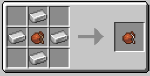

-  Для создания золотой фляги, нужна железная фляга и четыре слитка золота,

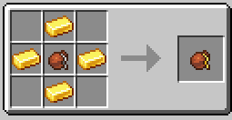

-  Для создания алмазной фляги, нужна золотая фляга и четыре алмаза,

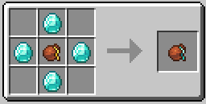

-  А для создания незеритовой фляги, нужна алмазная фляга, кузнечный стол, шаблон для улучшения и один незеритовый слиток.

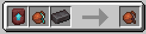

Каждое улучшение даёт дополнительный глоток, таким образом вместо двух глотков у кожаной фляги, будет шесть глотков у незеритовой.

#### Грязная вода и получение чистой воды

Но не спешите бежать к реке и пополнять фляги, ибо вода из реки грязная и при питье, у игрока появится эффект “Жажда”, который ускоряет трату уровня воды, примерно также как эффект “Голод” при поедании гнилой плоти.

Чтобы очистить воду, игроку нужно скрафтить **котёл для костра**. Для его крафта сперва необходимо скрафтить **медный котёл,** который крафтится, также как и обычный, но вместо железа медь.

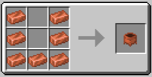 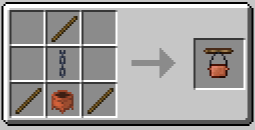

Затем, созданный котёл следует поставить на костёр и добавить воды, через короткий промежуток времени, вода в котле станет чистой и можно будет наливать в флягу, просто нажав по правой кнопкой по котлу, держа в руке флягу.

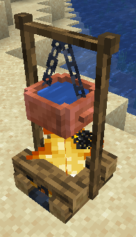 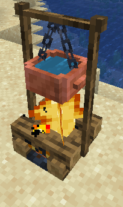 

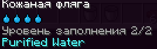

Также воду из котла можно взять с помощью ведра, тогда игрок получит ведро очищенной воды.

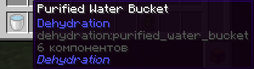

Можно использовать качок для воды, который крафтится из бамбука, ведра, плит из гладкого камня и рычага. Используется он для получения чистой воды, без использования костра.

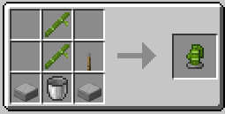

Для его работы требуется сначала поместить сам качок, затем поставить пустое ведро и выкачать чистую воду. У него есть перезарядка, что не даёт игроку получить воду в течении минуты, после использования.

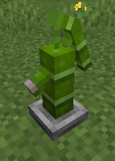 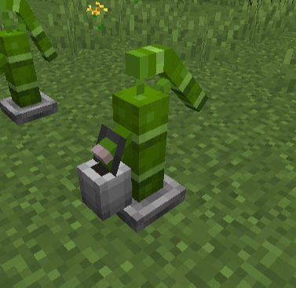 

Он работает не везде и не на всех блоках, поэтому игроку стоит найти удобное место, где качок будет работать.

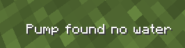

**Наполнять флягу стоит ТОЛЬКО из медного котла, ибо если вылить чистую воду на землю или в обычный котёл, а затем использовать флягу, то в фляге будет грязная вода.**
