## Обзор

[**Elytra trims**](https://modrinth.com/mod/elytra-trims) - это модификация за авторством [KikuGie ](https://modrinth.com/user/KikuGie)на Fabric, Forge, Neoforge, Quilt.

### Шаблоны брони на элитры

Модификация позволяет игрокам наносит шаблоны от брони, на элитры, создавая новые причудливые рисунки. Ставятся шаблон на элитры также, как и на броню, сильных отличий тут нет. Даже материалы не отличаются. Кузнечный стол на нём соединяем шаблон, материал и элитры -- и вот красивые крылышки.

 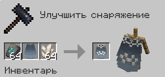

Вот пример разукрашенных кварцом и ванильными шаблонами элитр:

  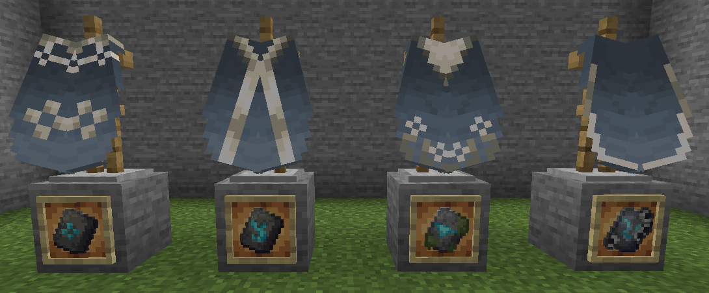
  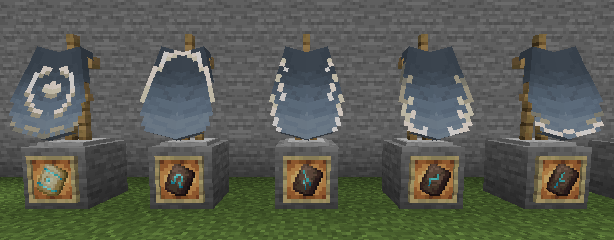
  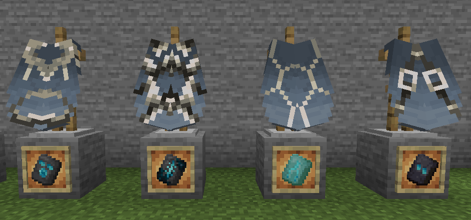
  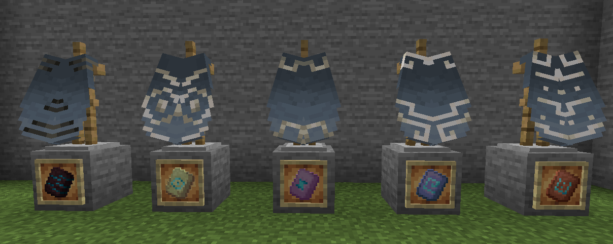

И разукрашенные с помощью шаблонов из мода More Armor Trims:

  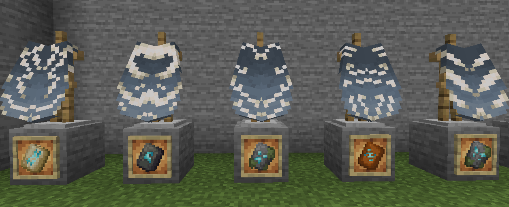
  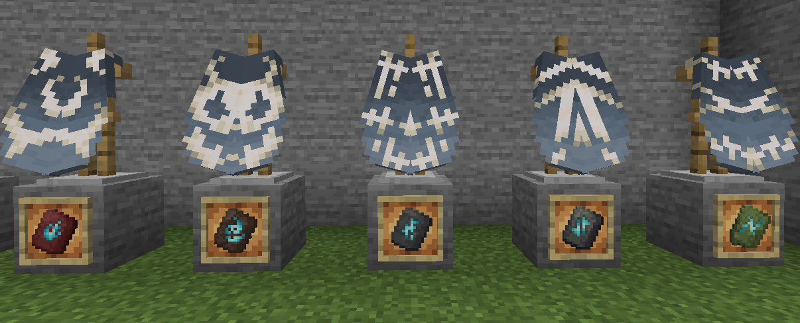

### А что есть ещё?

>Вот что!

#### Покраска элитр

Теперь используя красители можно красить элитры, также как и кожаную броню в ванильной игре, с помощью верстака.

 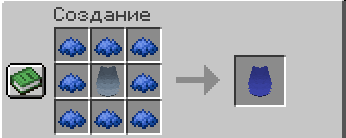

#### Установка флага

Также можно перевести рисунок с флага на элитры, примерно также, как и на ванильный щит, просто поставь флаг и элитры в сетку крафта.

 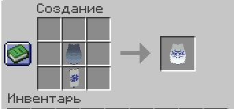

#### Светящиеся элитры

И наконец и можно сделать светящимся, соединив ваши элитры с светящимся чернильным мешком от светящегося спрута.

 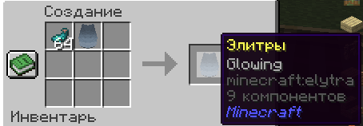

#### Пример покрашенных иными способами элитр

  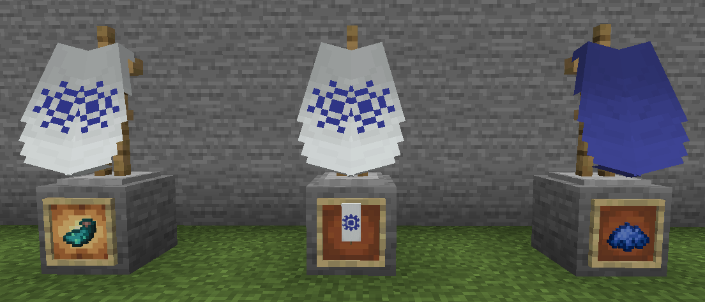
  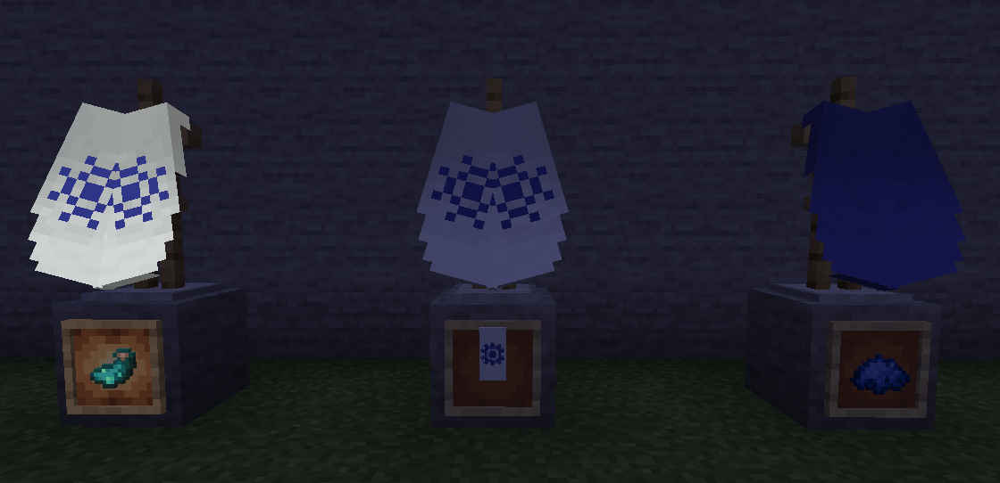

