## Обзор

[**More Armor Trims** ](https://modrinth.com/mod/more-armor-trims)\- это модификация на Fabric, за авторством [masik16u.](https://modrinth.com/user/masik16u)

Добавляет 10 новых шаблонов для брони, которые идеально будут смотреться на ваших доспехах и сделает ваш сет более уникальным.

### Получение и крафт

#### Шторм

Первым в нашим списке будет шаблон под названием “Шторм”. Его можно получить с 33% шансом при рыбалке в грозу, при этом игрок дополнительно получить сокровище. 

Для размножения шаблона нужен песчаник.

  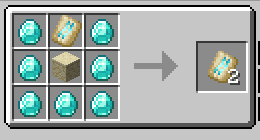

#### Таран

Шаблон выпадает при убийстве Разорителя, когда он везёт Заклинателя или при убийстве Заклинателя, когда он находится на Разорителе.

  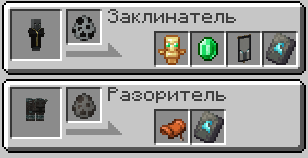

Для размножения шаблона нужен обыкновенный булыжник

  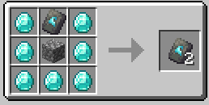

#### Миф

Шаблон можно купить у странствующего торговца за 15 изумрудов.

  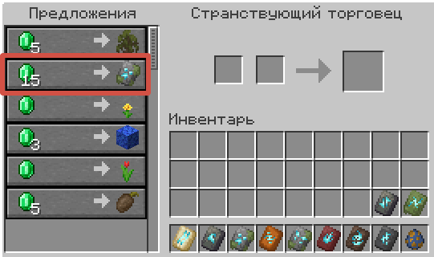

Для размножения требует замшелый булыжник.

  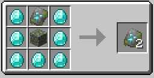

#### Алчность

Шаблон можно получить в заброшенной шахте, биома мессы, в сундуках с шансом 20%.

  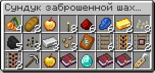

Для размножения требует красный песчаник.

  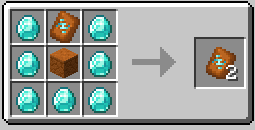

#### Зверь

Шаблон появляется в подвале иглу с шансом 50%.

  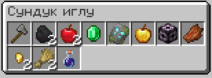

Для размножения требует также замшелый булыжник.

  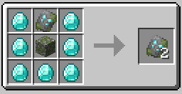

#### Жар

Шаблон появляется в Незере, в сундуках разрушенных порталов с шансом 20%.

  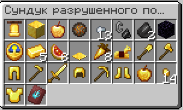

Для размножения нужен незерак.

  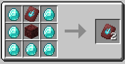

#### Дух

Шаблон выпадает при убийстве Визера в биоме Долина песка душ.

  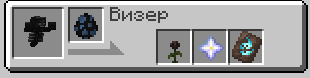

Для размножения нужна почва душ

  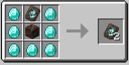

#### Ничтожество

Шаблон выпадает при ломании спавнера мобов с шансом 30%.

  

Для размножения требует колотый глубинный сланец.

  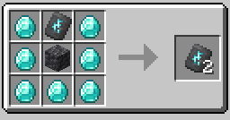

#### Горизонт

Шаблон можно найти в подозрительном гравии, в руинах холодного океана с шансом 6%.

Размножается обычным булыжником.

  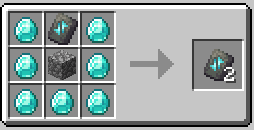

#### Происхождение

Может быть найден Нюхачём в биоме многолетней тайги с шансом 30%

Размножается с помощью блока мха.

  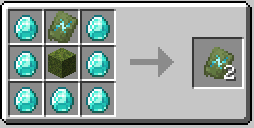

### Внешний вид

Пример всех шаблонов с классическим, как соната Бетховена, стилем покраски брони, незерит + золото.

  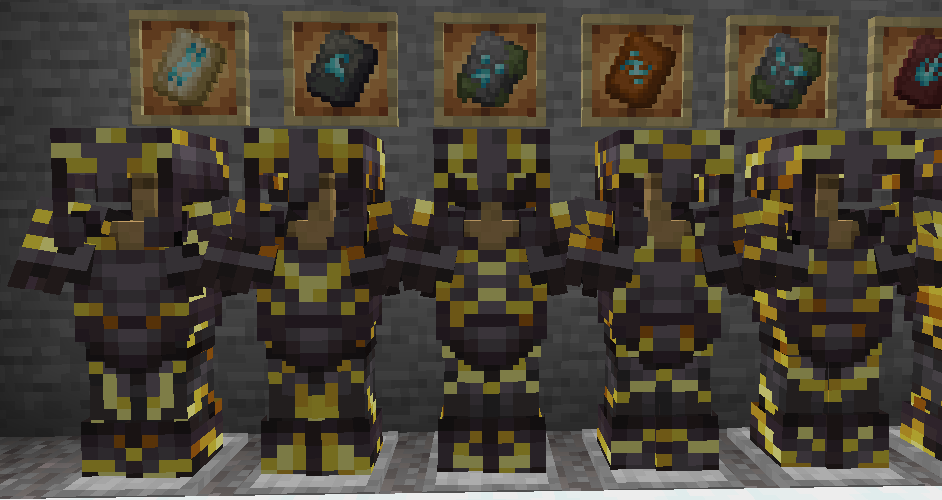
  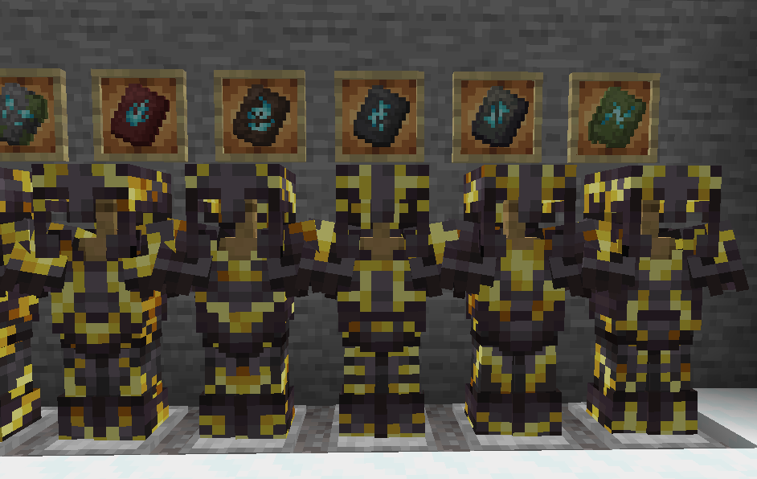

