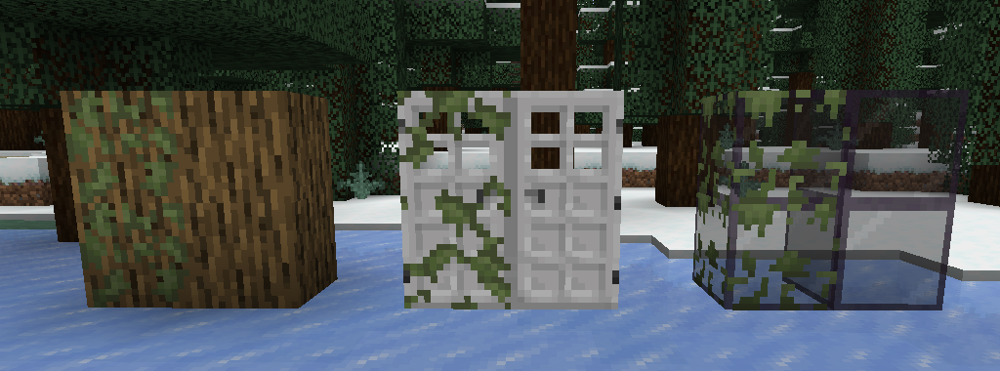

## Обзор

[Nemo’s Mossy Blocks ](https://modrinth.com/mod/nemos-mossy-blocks)\- это простая модификация на Fabric от [NemoNotFound](https://modrinth.com/user/NemoNotFound).

Мод добавляет вариации обычных блоков заросших мхом, а также новый бросаемый снаряд из мха.

### Крафты

#### Заросшие вариации

Стоит отметить, что практически все крафты одинаковы, изменяется лишь сам блок.

Так, блоками которые можно покрыть мхом, являются: все ванильные деревянные вариации блоков, все ванильные деревянные заборы, калитки, кнопки, плиты, бамбук и предметы крафтящиеся из бамбуковых досок, камень и каменные ступеньки, плиты, кнопки, кирпичи, узорчатые вариации и все ванильные виды стёкол. 

 
 
 
 
 
 

Мод в принципе даёт много новых вариаций стандартных блоков и их можно сделать просто в верстаке или в меню инвентаря, просто добавив блок мха или лозы к нужному блоку.

#### Мховый шарик

Мховый шарик - новый бросаемый предмет, также как яйцо или снежок. Убить моба или игрока, с помощью его нельзя. Крафтится из одного блока мха, и при крафте вы получаете 4 шарика, из которых можно снова скрафтить блок мха

 
  

