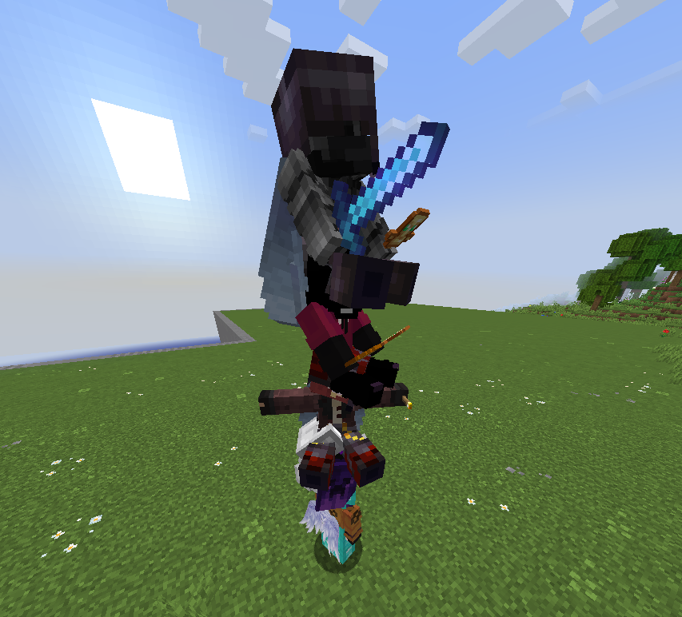
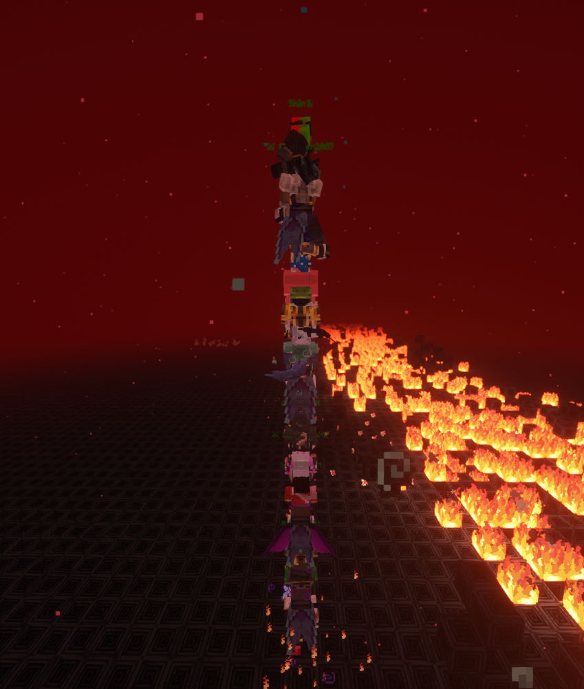
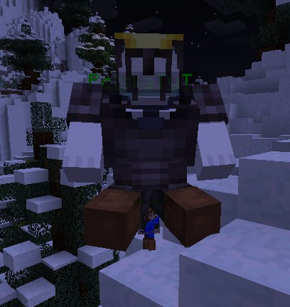

## Обзор

[**Player ladder**](https://modrinth.com/mod/player-ladder) \- это простенькая, но незаменимая на сервере модификация от [ForwarD-NerN](https://modrinth.com/user/ForwarD-NerN), на Fabric, Forge и Neoforge.

Её суть в том, что теперь игрок может поднять на себя  других игроков или мобов.

Казалось бы, простая модификация, добавленная ради шутки над другими игроками, для чтобы потом утаскивать их и после выкидывать в лаву, с высоты, в бездну или другие садистские способы убить игрока на ваш вкус. 

Однако эта модификация стала палочкой-выручалочкой на лорных ивентах, когда какому-нибудь игроку нужно отлучится от игры на пару минут, то его подберут и будут вести по лорным локация, до тех пор, пока игрок не вернётся, или в помощи перемещения, где игроки на элитрах помогают другим игрокам добраться до труднодоступных мест или до места смерти, чтобы вернуть вещи.
  

   <figure>
     
     <figcaption>Случайная лестница из случайных игроков</figcaption>
      
      <figcaption>Лестница из игроков на предфинальном лоре</figcaption>
     
     <figcaption>Храбый и маленький инхлинг, тащит на себе пугливого 80 кг дракона в броне<</figcaption>
   </figure>
  
 

Работает крайне просто - правая кнопка мыши по игроку или мобу, и вуаля - он на вашей голове! Больше ничего не нужно.

