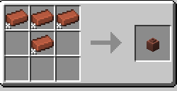

## Обзор

[**Pottery**](https://modrinth.com/mod/pottery) - модификация на Fabric, Forge, Neoforge и Quilt от [SuperMartijn642. ](https://modrinth.com/user/SuperMartijn642)

Мод добавляет пять новых вид ваз, позволяет их красить, с помощью красителей и спокойно менять рисунок на них.

### Изменения рисунка

Теперь, чтобы поменять рисунок на вазе, достаточно просто нажать правой кнопкой с фрагментом вазы или кирпичом и тогда рисунок поменяется. Никаких перекрафтов или разборок, теперь всё проще

### Новые вазы

Как говорилось ранее, мод добавляет пять новых видов ваз, а именно: обычная, не декоративная ваза, запечатанную вазу, широкая ваза, длинная ваза и маленькая ваза. Все они имеют ту же механику как ванильная ваза, но крафт в верстаке у всех отличается, например:

-  Для обычной вазы, нужно 4 кирпича или осколка, три из которых полностью заполняют первый ряд, а четвёртая находится в середине сетки.

 

-  Для запечатанной вазы требуется 5 кирпичей или 4 осколков вазы и один кирпич, одна каменная нажимная плита или нажимная плита из полированного чернита.

 

-  Для широкой вазы требуется 5 кирпичей или 4 осколков вазы и один кирпич, крафт схож с запечатанной вазой, но без плиты.

 

-  Для длинной вазы также требуется 5 кирпичей или 4 осколков вазы и один кирпич, но при этом расположение отличается от широкой вазы.

 

-  Для маленькой вазы нужно 4 кирпича или 4 осколка, расположение схоже с обычной вазой, но наоборот.

 

### Покраска ваз

Чтобы покрасить вазу, нужно нажать правой кнопкой по вазе, держа в руке нужный краситель, при повторной покраске, цвет полностью меняется, без возможности смешивания. 

 

Чтобы очистить вазу от цвета и вернуть ей оригинальный облик, нужно использовать котёл с водой, просто взяв в руку вазу и нажать правой кнопкой, при этом вода в котле уменьшится. 
