## Обзор

[**Tool Trims**](https://modrinth.com/datapack/tool-trims) - это модификация и датапак, на Fabric, Forge, Neoforge, Quilt от [JoeFly.](https://modrinth.com/user/JoeFly)

Мод добавляет возможность ставить шаблоны на оружие и инструменты, но только не ванильные шаблоны, а 4 новых шаблона специально сделанных для орудий труда.

### Крафты и получение новых шаблонов

#### Кузнечный стол для инструментов

  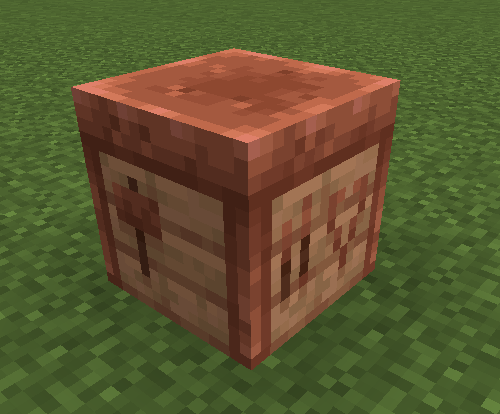

Чтобы поставить новые шаблоны на инструменты, или сделать больше шаблонов, нужен новый кузнечный стол, а именно предназначенный для инструментов. Крафтится он из двух слитков меди и четырёх любых досок. Вид схож с обычным кузнечным столом.

 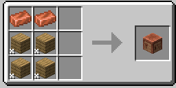

#### Шаблоны

Мод добавляет четыре новых шаблона: Линия, Трек, Заряд, Лёд. Они могут использоваться только на оружии и инструментах, поставить их на броню или элитры нельзя.

 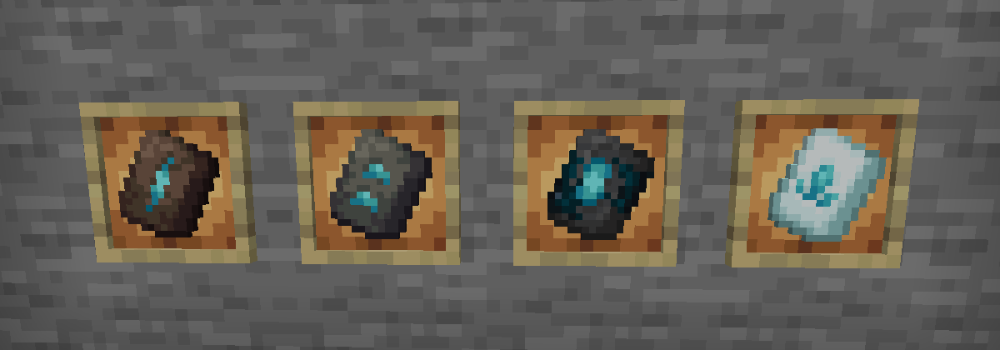

#### Шаблон Линия

Появляется в руинах былых времён в подозрительных блоках, с шансом 8,3%

Чтобы его размножить нужен стол кузнеца для инструментов, терракота и 7 алмазов и сам шаблон.

 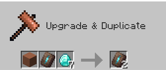

#### Шаблон Трек

Появляется в сундуках аванпоста разбойников с шансом 37,5%

Чтобы его размножить нужен стол кузнеца для инструментов, булыжник и 7 алмазов.

 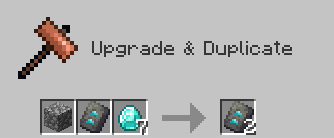

#### Шаблон Заряд

Появляется в сундуках Древнего города, с шансом 5%

Чтобы его размножить требуется стол кузнеца для инструментов, 7 алмазов и колотый глубинный сланец.

 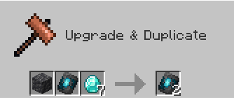

#### Шаблон Лёд

Появляется в сундуках иглу, с шансом 40%

Чтобы его размножить требуется стол кузнеца для инструментов, блок снега и 7 алмазов.

 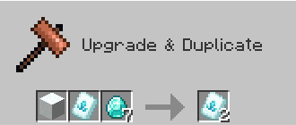

### Разукрашивание оружия

Чтобы украсить оружие нужно использовать кузнечный стол для инструментов, в обычном не сработает. В первый слот положить шаблон, в второй оружие и в третий материал и тогда вы получите красивое оружие.

 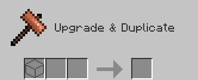
 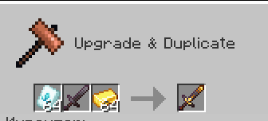

#### Внешний вид
Вот пример с незеритовым оружием и золотой отделкой, а также пример с луком, арбалетом и молотом.

    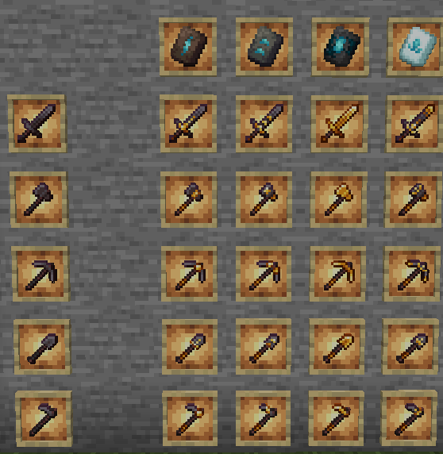
    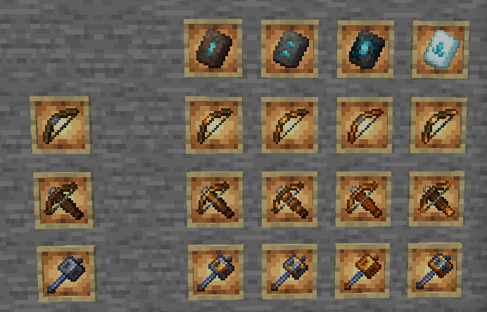

